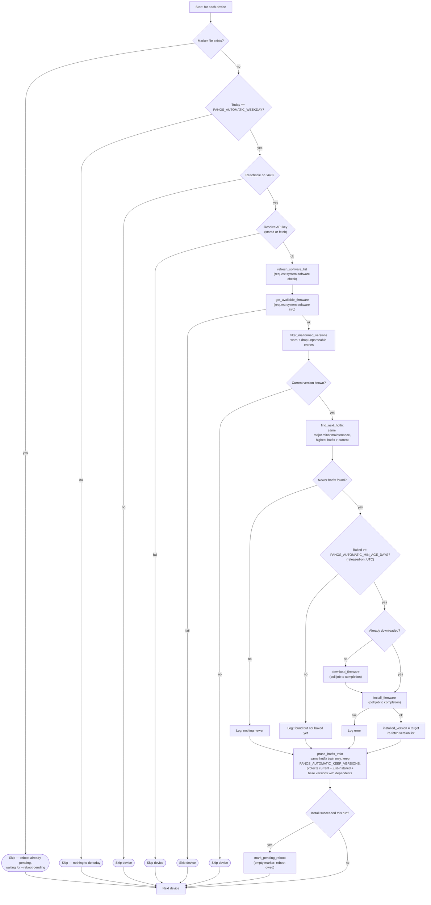
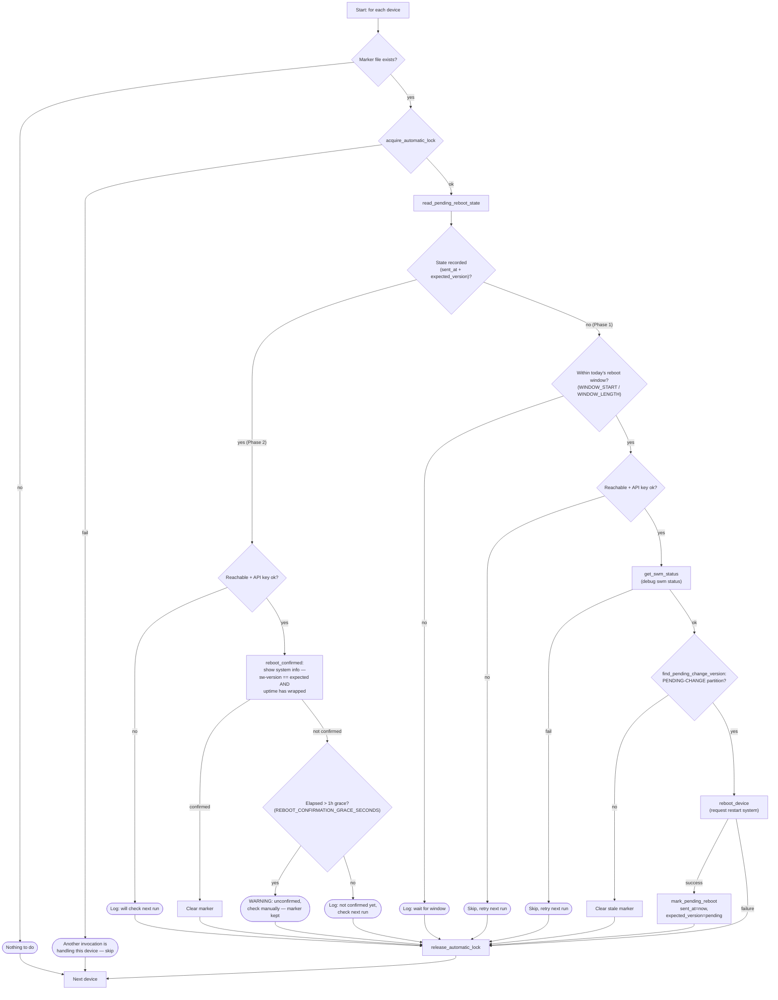

# PAN-OS Firmware Cleanup — Automatic Maintenance Flows

Lifecycle diagrams for the two unattended-maintenance flags, `--automatic`
and `--reboot-pending` — see [setup.md](setup.md#unattended-automatic-maintenance---automatic----reboot-pending)
for the cron/`.env` setup. Each is a per-device loop; a device that hits a
`Skip`/`Next device` outcome just waits for the next invocation.

## `--automatic` (daily)

## `--reboot-pending` (frequent, two-phase)

**Note on finding #32 (Low, open):** Phase 2's grace-period warning
(`H`/`H1` above) is only reached once a device answers `F` (reachable +
authenticated). A device unreachable past the 1-hour grace period prints
the routine `F1` "will check again next run" line instead, on every
invocation, rather than the persistent `H1` warning — reachability is
arguably the more accurate diagnosis in that case, but it means a long
outage never produces the one-time "still not confirmed" warning.
